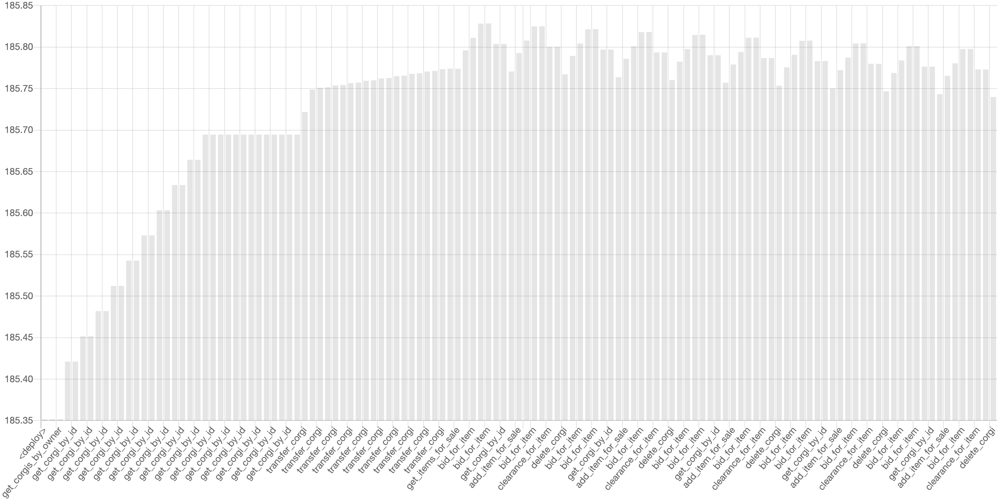

# Corgis contract

## Interacting with Corgis contract

The Corgis contract is located in the `contract` folder.
It is written in Rust.
Here is an overview on how to develop NEAR contracts using Rust:

<https://docs.near.org/docs/develop/contracts/rust/intro>

### Building

To build the Corgis contract:

```sh
cargo build --target wasm32-unknown-unknown --release
```

The contract is compiled down to a WASM binary.
You can find this binary in
`target/wasm32-unknown-unknown/release/corgis_nft.wasm`.

### Deploying our Corgis contract

To deploy our contract, we need `near-cli`.
The `near-cli` tool allows us to deploy and interact with contracts on the NEAR Blockchain.

We can deploy our contract with:

```sh
near deploy --wasmFile target/wasm32-unknown-unknown/release/corgis_nft.wasm
```

Alternatively, we can invoke an initialization function when deploying our contract:

```sh
near deploy --wasmFile target/wasm32-unknown-unknown/release/corgis_nft.wasm --initFunction new --initArgs '{}'  
```

### Reference

Here is a quick reference on how to interact with our Corgis contract on the NEAR Blockchain.
In the following sections,
`$CONTRACT_NAME` refers to the developer account.
This is the account that creates and deploys the contracts below.
On the other hand, `$ACCOUNT_NAME` refers to the end user account that uses our
Corgi site.

#### `create_corgi`

This contract method creates a corgi in the Blockchain.
In order to run the following command,
you must be logged in with the `$ACCOUNT_NAME`.

```sh
near --accountId $ACCOUNT_NAME call $CONTRACT_NAME create_corgi '{"name":"doggy dog","quote":"To err is human — to forgive, canine","color":"green","background_color":"blue"}'
```

This contract returns the `id` of the created `Corgi`.

#### `get_corgi_by_id`

Returns the `Corgi` given by `id`.

This is a view method.
Note the parameter is `&self` (without being mutable) in the method definition.
This means it doesn't modify state.
In the frontend (`/src/index.js`) this is added to the `"viewMethods"` array.

```sh
near view $CONTRACT_NAME get_corgi_by_id '{"id": "<corgi-id>"}'
```

The response returns an the specified `Corgi`, for example:

```js
{
  id: 'J9fEDeGE6vBODSjyetsZpLL7hCjm/IyvKmBTA1jUl3o=',
  name: 'doggy dog',
  quote: 'To err is human — to forgive, canine',
  color: 'green',
  background_color: 'blue',
  rate: 'COMMON',
  sausage: '27',
  owner: 'luis.testnet'
}
```

The `rate` field has the following type:

```typescript
type Rarity = 'COMMON'
            | 'UNCOMMON'
            | 'RARE'
            | 'VERY_RARE'
```

#### `get_corgis_by_owner`

```sh
near view $CONTRACT_NAME get_corgis_by_owner "{\"owner\":\"$ACCOUNT_NAME\"}"
```

Note that in this example we use double-quotes to be able to expand the shell variable `$ACCOUNT_NAME`.

The response returns an array of corgis, similar to:

```js
[
  {
    id: 'J9fEDeGE6vBODSjyetsZpLL7hCjm/IyvKmBTA1jUl3o=',
    name: 'doggy dog',
    quote: 'To err is human — to forgive, canine',
    color: 'green',
    background_color: 'blue',
    rate: 'COMMON',
    sausage: '27'
  },
]
```

#### `delete_corgi`

Deletes a `Corgi` by the given `id`.

```sh
near --accountId $ACCOUNT_NAME call $CONTRACT_NAME delete_corgi '{"id": "<corgi-id>"}'
```

#### `get_global_corgis`

This command returns all corgis that have been created.

```sh
near view $CONTRACT_NAME get_global_corgis
```

For the response body, see `get_corgis_by_owner`.

## Contract Profiler

The following chart shows the storage cost for a sample workload.
Explore the script [../test/measure.mjs](../test/measure.mjs) to check out the workload used.



## Development & Tooling

For Rust development with Visual Studio Code,
you may want to check out the _rust.analyzer_ extension

> <https://rust-analyzer.github.io/>
